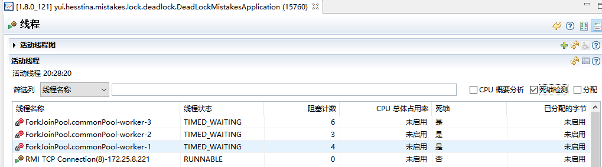
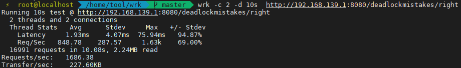

# 01 | 代码加锁：不要让“锁”事成为烦心事
## 原子性相关的问题
```java
package yui.hesstina.mistakes.lock.lockscope;
```

```http
GET http://localhost:8080/lockscope/wrong
```

只单方面的给 add 方法加锁，compare 没加锁也是没意义的
```text
2021-01-27 12:46:23.091  INFO 16084 --- [      Thread-48] y.h.m.lock.lockscope.AtomicMistakes      : compare start
2021-01-27 12:46:23.091  INFO 16084 --- [      Thread-47] y.h.m.lock.lockscope.AtomicMistakes      : add start
2021-01-27 12:46:23.091  INFO 16084 --- [      Thread-48] y.h.m.lock.lockscope.AtomicMistakes      : a: 8444, b: 8451, a < b: false
2021-01-27 12:46:23.092  INFO 16084 --- [      Thread-48] y.h.m.lock.lockscope.AtomicMistakes      : a: 23580, b: 23579, a < b: false
2021-01-27 12:46:23.092  INFO 16084 --- [      Thread-48] y.h.m.lock.lockscope.AtomicMistakes      : a: 30880, b: 30882, a < b: true
2021-01-27 12:46:23.118  INFO 16084 --- [      Thread-48] y.h.m.lock.lockscope.AtomicMistakes      : compare done
2021-01-27 12:46:23.125  INFO 16084 --- [      Thread-47] y.h.m.lock.lockscope.AtomicMistakes      : add done
```

```http
GET http://localhost:8080/lockscope/right
```

add 和 compareRight 都加锁
```text
2021-01-27 13:13:02.006  INFO 17064 --- [      Thread-45] y.h.m.lock.lockscope.AtomicMistakes      : add start
2021-01-27 13:13:02.025  INFO 17064 --- [      Thread-45] y.h.m.lock.lockscope.AtomicMistakes      : add done
2021-01-27 13:13:02.025  INFO 17064 --- [      Thread-46] y.h.m.lock.lockscope.AtomicMistakes      : compare start
2021-01-27 13:13:02.032  INFO 17064 --- [      Thread-46] y.h.m.lock.lockscope.AtomicMistakes      : compare done
```

## 对象锁的问题
```java
package yui.hesstina.mistakes.lock.lockscope;
```

- 错误的加锁方式
```http
GET http://localhost:8080/lockscope/wrong1
```

```json
{
  "result": 530093
}
```

- 正确的加锁方式
```http
GET http://localhost:8080/lockscope/right1
```

```json
{
  "result": 999999
}
```

## 加锁要考虑锁的粒度和场景问题
```java
package yui.hesstina.mistakes.lock.lockgranularity;
```

- 粒度太大，包括了慢方法
```http
GET http://localhost:8080/lockgranularitymistakes/wrong
```

```text
2021-01-29 15:41:54.971  INFO 848 --- [nio-8080-exec-1] .m.l.l.LockGranularityMistakesController : took:10696
```

- 小粒度，只处理共享数据的部分
```http
GET http://localhost:8080/lockgranularitymistakes/right
```

```text
2021-01-29 15:57:10.835  INFO 5268 --- [nio-8080-exec-5] .m.l.l.LockGranularityMistakesController : took:2743
```

## 多把锁要小心死锁问题
```java
package yui.hesstina.mistakes.lock.deadlock;
```

```http
GET http://localhost:8080/deadlockmistakes/wrong
```
```text
2021-01-29 20:28:21.928  INFO 15760 --- [nio-8080-exec-1] y.h.m.l.d.DeadLockMistakesController     : success:97 totalRemaining:9709 took:10013ms items:{item0=DeadLockMistakesController.Item(name=item0, remaining=974), item2=DeadLockMistakesController.Item(name=item2, remaining=972), item1=DeadLockMistakesController.Item(name=item1, remaining=965), item8=DeadLockMistakesController.Item(name=item8, remaining=970), item7=DeadLockMistakesController.Item(name=item7, remaining=975), item9=DeadLockMistakesController.Item(name=item9, remaining=969), item4=DeadLockMistakesController.Item(name=item4, remaining=971), item3=DeadLockMistakesController.Item(name=item3, remaining=973), item6=DeadLockMistakesController.Item(name=item6, remaining=973), item5=DeadLockMistakesController.Item(name=item5, remaining=967)}
```

三个线程发生了死锁


```http
GET http://localhost:8080/deadlockmistakes/right
```
